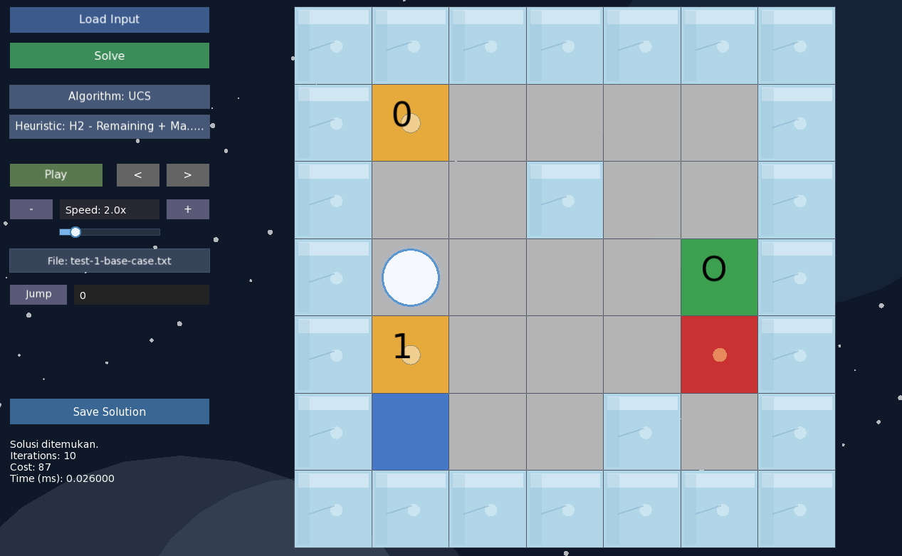

# Ice Sliding Puzzle Solver



## Deskripsi Singkat

Ice Sliding Puzzle Solver adalah program untuk mencari solusi permainan ice sliding puzzle dengan tiga algoritma pathfinding, yaitu Uniform Cost Search (UCS), Greedy Best-First Search (GBFS), dan A*. Program ini membaca file input papan, memvalidasi aturan permainan, mencari solusi, lalu menampilkan hasil berupa urutan langkah, total cost, jumlah iterasi, waktu eksekusi, visualisasi papan, dan playback solusi.

## Fitur-Fitur Program

- Mendukung tiga algoritma pencarian: UCS, GBFS, dan A*.
- Mendukung tiga heuristik: Manhattan to Target, Remaining Checkpoints + Manhattan, dan Weighted Remaining to Goal.
- Validasi input papan, checkpoint, start, goal, dan karakter yang diperbolehkan.
- Perhitungan cost berdasarkan tile yang dilewati selama sliding.
- Visualisasi langkah solusi di CLI.
- Playback solusi setelah pencarian selesai.
- Penyimpanan solusi dan log iterasi ke file `.txt`.
- GUI berbasis SFML untuk visualisasi interaktif.

## Struktur Project

```text
Tucil3_13524061/
├── bin/                # Executable hasil build
├── doc/                # Dokumen laporan dan aset pendukung
├── src/                # Source code program
├── test/               # File test case input
├── Makefile            # Build script
├── LICENSE             # Lisensi project
└── README.md           # Dokumentasi utama
```

## Requirement

- Compiler C++17, seperti `g++` atau `clang++`.
- GNU Make.
- Library SFML untuk GUI.
- `vcpkg` atau setup library lokal yang sesuai untuk environment Anda.

## How To Run

### CLI

Build program CLI:

```bash
make build
```

Jalankan program CLI dengan file input:

```bash
make run INPUT=test/test-1-base-case.txt
```

Atau jalankan executable secara langsung setelah build:

```bash
./bin/solver test/test-1-base-case.txt
```

### GUI

Build program GUI:

```bash
make gui
```

Jalankan GUI:

```bash
make run-gui
```

## Format Input File

Format file input adalah:

```text
N M
[N baris peta]
[N baris cost per tile]
```

Keterangan simbol pada peta:

- `*` = path
- `X` = batu / rintangan
- `L` = lava
- `Z` = posisi awal
- `O` = tujuan
- `0`-`9` = checkpoint yang harus dilewati berurutan

Contoh singkat:

```text
3 3
Z*0
***
**O
1 1 1
1 1 1
1 1 1
```

## License

Project ini menggunakan lisensi MIT. Lihat file [LICENSE](LICENSE) untuk detail lengkap.

## Author

Muhammad Aufar Rizqi Kusuma  
13524061